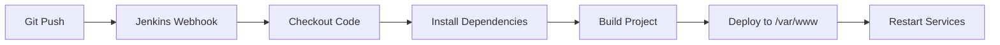

# Arquitetura do Sistema PedroDapps

## Visão Geral

Este documento explica a arquitetura completa do sistema PedroDapps, incluindo Kong API Gateway, Docker, Jenkins CI/CD e acesso remoto.

## 🏗️ Componentes da Arquitetura

### 1. Kong API Gateway

**Kong** é um API Gateway de código aberto que atua como proxy reverso entre os clientes e nossos serviços backend.

#### Configuração Atual:
- **Modo**: Database (PostgreSQL) - migrado de DB-less
- **Porta Admin**: 8001
- **Porta Proxy**: 8000, 8443 (HTTPS)
- **Banco de Dados**: PostgreSQL (container `compose-db-1`)

#### Serviços Configurados:
```yaml
# Serviço Pixley (existente)
- Nome: pixley-app
- Host: 172.17.0.1:3007
- Rota: crypto.pixley.app

# Serviço PedroDapps (novo)
- Nome: pedrodapps-website
- Host: localhost:8085
- Rotas: pedrodapps.com, www.pedrodapps.com
```

#### Plugins Ativos:
- **Rate Limiting**: Controle de taxa de requisições
- **CORS**: Cross-Origin Resource Sharing
- **Bot Detection**: Detecção de bots maliciosos
- **Request Size Limiting**: Limitação do tamanho das requisições

### 2. Docker e Containers

#### Containers Ativos:
```bash
# Kong API Gateway
compose-kong-1
- Imagem: kong:3.9.1
- Portas: 8000, 8001, 8002, 8444
- Rede: compose_kong-net

# PostgreSQL Database
compose-db-1
- Imagem: postgres:13
- Porta: 5432
- Volume: postgres_data
- Rede: compose_kong-net
```

#### Configuração Docker Compose:
```yaml
# Localização: /home/ubuntu/docker-kong/compose/docker-compose.yml
services:
  kong:
    image: kong:3.9.1
    environment:
      KONG_DATABASE: postgres
      KONG_PG_HOST: db
      KONG_PG_USER: kong
      KONG_PG_PASSWORD_FILE: /run/secrets/kong_postgres_password
    networks:
      - kong-net
    ports:
      - "8000:8000"
      - "8001:8001"
      - "8002:8002"
      - "8444:8444"
```

### 3. Jenkins CI/CD

#### Configuração:
- **URL**: http://187.108.196.14:8080
- **Usuário**: jenkins
- **Workspace**: `/var/www/pedrodapps_website`

#### Pipeline (Jenkinsfile):
```groovy
pipeline {
    agent any
    
    stages {
        stage('Checkout') {
            steps {
                git branch: 'main', 
                    url: 'https://github.com/usuario/pedrodapps_website.git'
            }
        }
        
        stage('Install Dependencies') {
            steps {
                sh 'yarn install'
            }
        }
        
        stage('Build') {
            steps {
                sh 'yarn build'
            }
        }
        
        stage('Deploy') {
            steps {
                sh '''
                    sudo rsync -av --delete dist/ /var/www/pedrodapps_website/
                    sudo chown -R jenkins:www-data /var/www/pedrodapps_website/
                    sudo chmod -R 755 /var/www/pedrodapps_website/
                '''
            }
        }
    }
}
```

### 4. Servidor Web de Produção

#### Nginx (Recomendado para Produção):
```nginx
# /etc/nginx/sites-available/pedrodapps-8085
server {
    listen 8085;
    server_name localhost;
    root /var/www/pedrodapps_website/dist;
    index index.html;
    
    # SPA Support
    location / {
        try_files $uri $uri/ /index.html;
    }
    
    # Cache para assets estáticos
    location ~* \.(js|css|png|jpg|jpeg|gif|ico|svg)$ {
        expires 1y;
        add_header Cache-Control "public, immutable";
    }
}
```

## 🔄 Fluxo de Deploy

### 1. Desenvolvimento Local
```bash
# Desenvolvimento
yarn dev  # Porta 8085 (configurada no vite.config.js)

# Build para produção
yarn build  # Gera pasta dist/
```

### 2. CI/CD com Jenkins


### 3. Acesso via Kong
```
Cliente → Kong (porta 8000) → Nginx (porta 8085) → Aplicação React
```

## 🌐 Acesso Remoto

### SSH para o Servidor:
```bash
ssh -p22 ubuntu@187.108.196.14
```

### Estrutura de Diretórios:
```
/home/ubuntu/
├── docker-kong/
│   └── compose/
│       ├── docker-compose.yml
│       ├── docker-compose-with-db.yml
│       └── config-backup-*/
└── /var/www/
    └── pedrodapps_website/
        ├── dist/           # Build de produção
        ├── src/            # Código fonte
        ├── package.json
        └── Jenkinsfile
```

## 🔧 Comandos Úteis

### Kong:
```bash
# Listar serviços
curl -s http://localhost:8001/services | jq .

# Listar rotas
curl -s http://localhost:8001/routes | jq .

# Testar rota
curl -H "Host: pedrodapps.com" http://localhost:8000/
```

### Docker:
```bash
# Status dos containers
docker ps

# Logs do Kong
docker logs compose-kong-1

# Logs do PostgreSQL
docker logs compose-db-1

# Reiniciar Kong
docker-compose restart kong
```

### Jenkins:
```bash
# Status do serviço
sudo systemctl status jenkins

# Logs do Jenkins
sudo journalctl -u jenkins -f

# Reiniciar Jenkins
sudo systemctl restart jenkins
```

## 🔒 Segurança

### Firewall (UFW):
```bash
# Portas abertas
22/tcp    # SSH
8000/tcp  # Kong Proxy
8001/tcp  # Kong Admin (apenas localhost)
8080/tcp  # Jenkins
8085/tcp  # Nginx (apenas localhost)
```

### Permissões:
```bash
# Diretório da aplicação
chown -R jenkins:www-data /var/www/pedrodapps_website/
chmod -R 755 /var/www/pedrodapps_website/
```

## 🚀 Próximos Passos

1. **SSL/TLS**: Configurar certificados SSL para HTTPS
2. **Monitoring**: Implementar monitoramento com Prometheus/Grafana
3. **Backup**: Configurar backup automático do banco PostgreSQL
4. **Load Balancing**: Configurar múltiplas instâncias da aplicação
5. **CDN**: Implementar CDN para assets estáticos

## 📞 Troubleshooting

### Kong não responde:
```bash
# Verificar status
docker ps | grep kong

# Verificar logs
docker logs compose-kong-1

# Reiniciar
cd /home/ubuntu/docker-kong/compose
docker-compose restart kong
```

### Jenkins build falha:
```bash
# Verificar permissões
ls -la /var/www/pedrodapps_website/

# Verificar logs
sudo journalctl -u jenkins -f
```

### Aplicação não carrega:
```bash
# Verificar Nginx
sudo nginx -t
sudo systemctl status nginx

# Verificar arquivos
ls -la /var/www/pedrodapps_website/dist/
```

---

**Autor**: Sistema PedroDapps  
**Data**: Outubro 2024  
**Versão**: 1.0